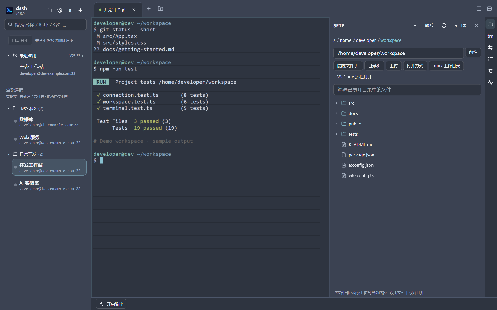
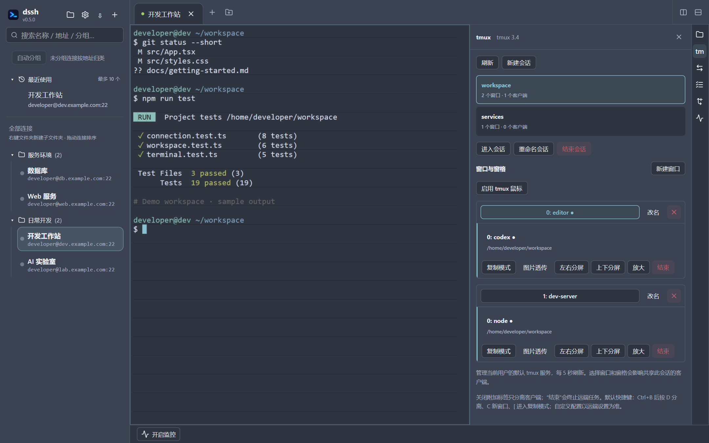

<p align="center">
  
</p>

<h1 align="center">dssh</h1>

<p align="center">把远程终端、文件和开发任务放在同一个工作区。</p>
<p align="center"><strong>v1.1.3</strong> · Tauri SSH 客户端 · Windows / macOS</p>

dssh 面向日常远程开发与服务器管理：连接服务器、在 tmux 中运行长任务、编辑远程文件、查看代码差异，也能给远程 Codex、Claude 等工具粘贴截图路径。



*当前应用前端的界面截图，使用虚构服务器、示例文件和模拟终端输出；不包含真实连接信息。下方截图同样使用演示数据。*

## ✨ 功能一览

| 想做什么 | dssh 提供什么 |
| --- | --- |
| 管理多台服务器 | 文件夹分组、搜索、最近连接、拖拽排序、克隆与批量导入 |
| 同时处理多个会话 | 多标签页、左右 / 上下双窗格分屏、连接状态与断线重连 |
| 让远程任务持续运行 | tmux 会话、窗口和窗格管理，重新连接后继续附加 |
| 处理远程文件 | SFTP 文件树、上传下载、在线文本编辑与 Markdown 预览 |
| 配合终端 AI 工具工作 | 截图上传并插入路径、终端内图片显示、任务状态与提醒 |
| 查看项目改动 | 按未暂存、已暂存和新文件分组，查看 Git 差异 |
| 访问远程服务 | 本地转发、远程转发、动态 SOCKS5 代理 |
| 了解服务器状态 | CPU、内存、负载、网络、磁盘与进程监控 |
| 在多台电脑间切换 | 通过 GitHub 加密备份和恢复连接、凭据、私钥及界面设置 |

## 🖥️ 连接与终端

- **整理连接**：支持多级文件夹、搜索、最近使用、拖动连接排序与移动分组；可以克隆现有配置，也可以预览后批量导入连接文本。
- **密码与私钥登录**：保存的密码和私钥口令交给系统凭据库管理，私钥可通过文件选择器指定。
- **多会话并行**：同一服务器可打开多个标签；支持标签重命名、复制会话和批量关闭。单个标签可左右或上下分成两个窗格。
- **断线后继续操作**：显示连接状态，断线后保留终端滚动内容，按 `R` 或点击按钮原地重连。
- **中文与外观**：支持中文输入，内置 Nord、Tokyo Night、Catppuccin 等深浅色主题；字体、字号和主题即时生效，工具面板可左右停靠并调整宽度。

## 📁 文件就在终端旁边

在同一个窗口里浏览目录、改配置、读文档，或把项目交给本地编辑器。

- **浏览与定位**：文件树、隐藏文件开关、路径输入、目录筛选；可跟随终端目录，也可选择 tmux 窗格的工作目录。
- **传输与管理**：拖拽上传、下载、新建目录、重命名和删除；上传队列显示进度与速度，支持取消。
- **在线编辑**：编辑不超过 1 MB 的 UTF-8 文本，保存前检查远端冲突并建立备份；Markdown 可切换渲染预览与源码编辑。
- **本地打开**：双击文件下载并用本地应用打开；也可通过 VS Code Remote - SSH 打开当前远程目录。

支持拖入文件夹递归上传，保留子目录和空目录；下载到本地应用后所做的修改不会自动回传。详见[文件工作区](docs/file-workspace.md)与 [VS Code 远程打开](docs/vscode-remote.md)。

## 🔁 用 tmux 留住工作现场



- 自动发现远端会话，新建、重命名，或在新标签中附加已有会话。
- 管理窗口和窗格，切换焦点、左右 / 上下分屏、放大还原、进入复制模式。
- 关闭附加标签只分离本客户端，远端任务继续运行；网络断开后最多自动尝试重连三次。
- 可为所选会话启用鼠标，为指定窗格启用图片透传。

远端需安装 tmux，目前管理默认 socket。图片透传需要 tmux 3.3+ 及远端应用配合。详见 [tmux 使用说明](docs/tmux.md)。

## 🖼️ 更方便地使用终端 AI 工具

**截图 → 粘贴到终端 → 上传到远程 → 插入图片路径 → 补充问题并发送。**

复制截图后，在目标终端粘贴，dssh 会上传 PNG 并插入远程绝对路径，不会自动回车。支持 20 MB 以内的 PNG；是否能读取图片由远端工具和模型决定。

支持 Kitty graphics 协议的程序还可以在终端内直接显示图片，双击即可打开预览窗。

配合右侧工具面板，可以同时关注任务进度和代码变化：

- **任务状态与提醒**：查看终端活动、断开状态和工具通知，点击任务卡片跳回对应窗格；可开启桌面提醒。根据终端文字推测的完成、错误或等待状态会明确标注。
- **代码修改**：选择远程 Git 项目，查看未暂存、已暂存及新文件，点击查看差异。此面板只读，包含该工作区的所有改动。

详见[工作区工具](docs/workspace-tools.md)。

## 🌐 转发、监控与同步

可选的 **Agent 协作** 可在「设置 → Agent 协作」按 tmux 会话 + worktree 配置并开启，查看 taskboard 的共享任务与交接，
通过 amail 查询、预览发送或回复消息。默认关闭，凭据留在远端。详见 [Agent 协作接入](docs/agent-collaboration.md)。

给 Claude Code、Codex CLI、pi 的创建 worktree、开箱、认领及交接流程见 [Agent 操作手册](docs/agent-playbook.md)。

| 功能 | 使用方式 |
| --- | --- |
| **端口转发** | 创建本地 / 远程转发或动态 SOCKS5 代理；规则随服务器保存，支持编辑、启停及连接后自动启动。 |
| **服务器监控** | 底部摘要查看 CPU、内存、磁盘和网络速率；展开面板查看趋势、负载、网卡、磁盘读写及进程。 |
| **加密同步** | 在「设置 → 同步」填写 GitHub 仓库、访问令牌和同步密码，上传完整备份，在另一台电脑恢复。 |

同步包含连接、分组、保存的密码、引用的私钥及口令、转发规则、主题和布局，使用 Argon2 派生密钥与 AES-256-GCM 在本机加密后上传。**恢复会替换本机连接列表**；正在运行的 SSH / tmux 进程不属于备份。详见[完整加密同步](docs/full-sync.md)。

## 🚀 开始使用

1. 安装并启动 dssh，点击左侧 `+` 添加服务器，填写地址、用户名及认证信息。
2. 双击服务器建立连接；需要多个工作窗口时，新建标签或使用分屏。
3. 从终端旁的工具栏打开文件、tmux、任务、代码修改、端口转发或监控面板。

安装包与构建记录可查看仓库的 [Releases](https://github.com/hendyzone/dssh/releases) 和 [Actions](https://github.com/hendyzone/dssh/actions)。构建流程包含 Windows、macOS 和 Linux；具体可下载平台以对应构建产物为准。

<details>
<summary>从源码运行与构建</summary>

主应用位于 `apps/desktop`，采用 Tauri 2、React、ghostty-web 和 russh。

准备 Node.js 22、Rust stable 和对应平台的 Tauri 2 系统构建依赖。Windows 还需 C++ 构建工具、WebView2 与 NASM；Linux 依赖列表见[构建工作流](.github/workflows/build-windows.yml)。

```bash
cd apps/desktop
npm ci
npm run tauri dev
```

构建安装包：

```bash
npm run tauri build
```

安装包输出到 `apps/desktop/src-tauri/target/release/bundle/`。

</details>

<details>
<summary>更多文档与项目结构</summary>

- [批量导入 SSH 连接](docs/ssh-import.md)
- [文件工作区与截图粘贴](docs/file-workspace.md)
- [任务、代码修改与 Markdown](docs/workspace-tools.md)
- [tmux 会话管理](docs/tmux.md)
- [VS Code 远程打开](docs/vscode-remote.md)
- [完整加密同步](docs/full-sync.md)
- [架构设计](docs/architecture.md)

| 路径 | 内容 |
| --- | --- |
| `apps/desktop` | 桌面应用 |
| `vendor/ghostty-web` | 支持 Kitty graphics 的终端组件 |
| `docs` | 功能说明与设计文档 |
| `prototypes/kitty-image` | 早期终端图片协议验证原型 |

</details>
